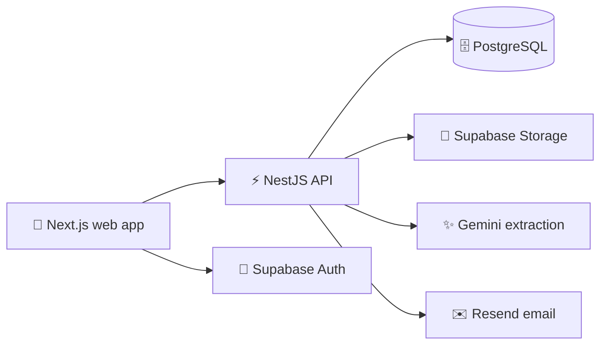

<!-- @format -->

<div align="center">

# 🌈 FirstDay 😊

### A clear, calm onboarding workspace for recruiters and joinees ✨

[](https://github.com/Moleesh/FirstDay/actions/workflows/ci.yml)
[](https://github.com/Moleesh/FirstDay/actions/workflows/security.yml)
[](https://github.com/Moleesh/FirstDay/actions/workflows/deploy.yml)
[](https://nodejs.org/)
[](https://pnpm.io/)

**FirstDay** helps recruiters create onboarding packs, invite joinees, track
progress, review documents, collect signatures, and generate completed PDFs.
Joinees get a simple guided flow from upload to download. 😊

[Live App](https://moleesh.github.io/FirstDay) ·
[Repository](https://github.com/Moleesh/FirstDay) ·
[CI Runs](https://github.com/Moleesh/FirstDay/actions/workflows/ci.yml) ·
[Security Scans](https://github.com/Moleesh/FirstDay/actions/workflows/security.yml) ·
[Issues](https://github.com/Moleesh/FirstDay/issues)

</div>

## ✨ Product Tour

| Area            | What You Can Do                                                                          |
| --------------- | ---------------------------------------------------------------------------------------- |
| 🧑‍💼 Recruiter    | Build reusable packs, map PDF fields, invite joinees, and review onboarding progress.    |
| 😊 Joinee       | Upload documents, review fields, sign consent, and download the completed pack.          |
| 🎨 Appearance   | Choose light, dark, or system mode and switch between accent themes.                     |
| 🔐 API platform | Use Supabase auth and storage, audit logs, signed URLs, CSRF protection, and throttling. |

The web app includes a recruiter template wizard, editable document checklists,
reference-template extraction, PDF page ordering, field annotations, joinee pack
downloads, welcome-link sharing, role-aware login screens, redirect-safe
`/FirstDay` routes, trial sign-ins, and a responsive onboarding experience. 🌈

## 🚀 Run Locally

### Prerequisites

- [Node.js 24](https://nodejs.org/)
- [pnpm 9.15.4](https://pnpm.io/installation)
- PostgreSQL or a [Supabase](https://supabase.com/) project
- Optional integration keys for Gemini and Resend

### Setup

```bash
pnpm install
cp .env.example .env
pnpm dev
```

On Windows PowerShell, use `Copy-Item .env.example .env` instead of `cp`.

Open the published app at
[https://moleesh.github.io/FirstDay](https://moleesh.github.io/FirstDay). 🌍

### Trial Sign-In 😊

The current web experience includes prefilled trial accounts for product
reviews. Click **Sign in** or **Continue onboarding** after opening the matching
login page.

| Role         | Login URL                                                                    | Username or ID  | Password or code |
| ------------ | ---------------------------------------------------------------------------- | --------------- | ---------------- |
| 🧑‍💼 Recruiter | [Recruiter sign-in](https://moleesh.github.io/FirstDay/login?role=recruiter) | `recruiter`     | `firstday`       |
| 😊 Joinee    | [Joinee sign-in](https://moleesh.github.io/FirstDay/login?role=joinee)       | `JN-2026-00042` | `firstday`       |

> These are development-only trial credentials. Do not use them as production
> authentication.

## 🔑 Environment Variables

Create `.env` from [`.env.example`](./.env.example) and replace sample values.
Never commit `.env` files. For GitHub Actions, use
[`.env.ci.example`](./.env.ci.example) as a safe reference and add the real
values as repository secrets. 🔐

| Name                                   | Used By | Purpose                               |
| -------------------------------------- | ------- | ------------------------------------- |
| `SUPABASE_SECRET_KEY`                  | API     | Server-only Supabase secret key       |
| `WEB_ORIGIN`                           | API     | Allowed browser origin                |
| `NEXT_PUBLIC_API_URL`                  | Web     | Browser-facing API URL                |
| `NEXT_PUBLIC_SUPABASE_PUBLISHABLE_KEY` | Web     | Browser-safe Supabase publishable key |
| `NEXT_PUBLIC_SUPABASE_URL`             | API/Web | Shared Supabase project URL           |

Optional integrations:

| Name             | Used By | Purpose                        |
| ---------------- | ------- | ------------------------------ |
| `GEMINI_API_KEY` | API     | Gemini document extraction key |
| `RESEND_API_KEY` | API     | Notification email key         |

## 🧭 Architecture



| Layer      | Stack                                                              |
| ---------- | ------------------------------------------------------------------ |
| Monorepo   | Turborepo, pnpm workspaces                                         |
| Web        | Next.js 14, React 18, SCSS modules, Zustand, Jotai, TanStack Query |
| API        | NestJS 10, Fastify, Supabase JS, Passport, Swagger                 |
| Documents  | Gemini, `pdf-lib`, React PDF, signature canvas                     |
| Quality    | Vitest, Playwright, ESLint, Prettier, pnpm audit, TruffleHog       |
| Deployment | Platform-neutral GitHub Actions checks                             |

```text
apps/
├── api/       NestJS API, Supabase integration, and API tests
└── web/       Next.js app, SCSS modules, components, and Playwright flows

packages/
├── config/    Shared tooling configuration
├── schemas/   Shared Zod schemas
├── types/     Shared TypeScript types
└── ui/        Shared UI components
```

## 🧪 Commands

| Command                             | Purpose                        |
| ----------------------------------- | ------------------------------ |
| `pnpm dev`                          | Start the workspace            |
| `pnpm build`                        | Build apps and packages        |
| `pnpm lint`                         | Run ESLint                     |
| `pnpm format`                       | Check Prettier formatting      |
| `pnpm test`                         | Run automated tests            |
| `pnpm typecheck`                    | Run TypeScript checks          |
| `pnpm validate:env`                 | Validate environment variables |
| `pnpm --filter @onboarding/web e2e` | Run Playwright flows           |

## 🚢 GitHub Actions Setup

Add these repository secrets under **Settings → Secrets and variables → Actions**
before running deployments:

| Secret                                 | Required For                     |
| -------------------------------------- | -------------------------------- |
| `SUPABASE_SECRET_KEY`                  | Server-side Supabase operations  |
| `WEB_ORIGIN`                           | API browser-origin allowlist     |
| `NEXT_PUBLIC_API_URL`                  | Browser API endpoint             |
| `NEXT_PUBLIC_SUPABASE_PUBLISHABLE_KEY` | Browser-safe Supabase access     |
| `NEXT_PUBLIC_SUPABASE_URL`             | Shared Supabase project endpoint |

Optional deployment secrets: `GEMINI_API_KEY` enables document extraction and
`RESEND_API_KEY` enables notification emails.

| Workflow                                                                       | Trigger                              |
| ------------------------------------------------------------------------------ | ------------------------------------ |
| [CI](https://github.com/Moleesh/FirstDay/actions/workflows/ci.yml)             | Pull requests and manual runs        |
| [Security](https://github.com/Moleesh/FirstDay/actions/workflows/security.yml) | Mondays at 03:00 UTC and manual runs |

Database schema changes live in [`supabase/migrations`](./supabase/migrations).
Apply them through the Supabase dashboard or Supabase CLI before deploying API
features that use new tables.

## 🛡️ Security Notes

- Keep local secrets in `.env` and deployment secrets in GitHub Actions. 🔐
- Keep Supabase secret keys server-side only.
- Trial credentials are for development reviews only.
- The API includes Helmet, throttling, CSRF protection, audit logging, signed
  storage URLs, and server-side MIME validation.

## 🤝 Contributing

1. Create a focused branch.
2. Keep source files below 200 lines where practical.
3. Add tests for behavior changes.
4. Run formatting, linting, type checks, tests, and builds before pushing.
5. Confirm that no secrets were committed.

## 📄 License

No license file is currently included. Treat this repository as proprietary
until a license is added.

---

<div align="center">

Built to make every first day feel lighter, clearer, and happier. 😊 🌈 ✨

</div>
